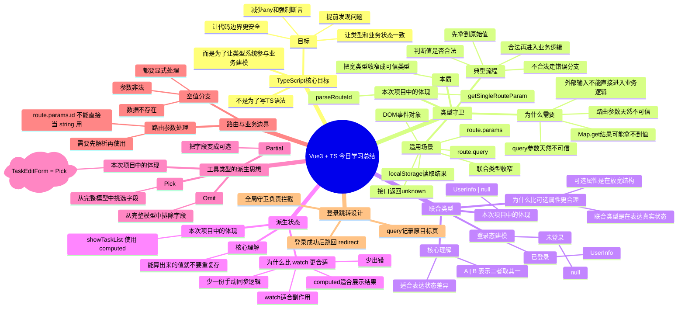

# Vue3 + TypeScript 学习笔记

## 今日主题

今天不是单纯学了几条 TypeScript 语法，而是开始建立一种更贴近真实项目的思维：

- 边界值先解析，再进入业务逻辑
- 状态差异用联合类型表达
- 展示结果优先用 `computed` 派生
- 类型尽量从主模型派生，不重复手写多份近似结构
- 不要为了“消除报错”滥用 `any` 和 `as`

---

## 思维导图



---

## 1. 类型守卫

### 1.1 核心理解

类型守卫的本质不是“多写一个 `if`”，而是：

> 把一个不可信的宽类型，收窄成一个可信的窄类型。

例如路由参数 `route.params.id` 在 Vue Router 里本来不是单纯的 `string`，而更接近：

```ts
string | string[] | undefined
```

如果直接写：

```ts
const id = route.params.id as string
```

这只是告诉 TypeScript “你相信它一定是 string”，但并没有真的验证它。

更合理的做法是先解析：

```ts
export const parseRouteId = (
  value: RouteParamValue | RouteParamValue[] | undefined
): number | null => {
  const rawValue = getSingleRouteParam(value)

  if (rawValue === null) {
    return null
  }

  const taskId = Number(rawValue)
  return Number.isInteger(taskId) ? taskId : null
}
```

### 1.2 本项目中的体现

- 路由参数解析：[src/utils/route.ts](/d:/data/paipaiHighLevel/01_Projects/Exam/vue3-knowledge-test/src/utils/route.ts)
- 详情页使用解析结果：[src/components/TaskDetail.vue](/d:/data/paipaiHighLevel/01_Projects/Exam/vue3-knowledge-test/src/components/TaskDetail.vue)
- 编辑页使用解析结果：[src/components/TaskEdit.vue](/d:/data/paipaiHighLevel/01_Projects/Exam/vue3-knowledge-test/src/components/TaskEdit.vue)

### 1.3 使用场景

类型守卫很适合用在“边界层”：

- `route.params`
- `route.query`
- `Map.get()` 的返回值
- `localStorage` 读取结果
- 接口返回的 `unknown`
- 联合类型收窄

### 1.4 易错点

- `as string` 不等于验证
- `as number` 不会把非法值自动变合法
- 守卫的作用不是“骗过 TS”，而是“让 TS 和运行时事实一致”

---

## 2. 联合类型

### 2.1 核心理解

联合类型 `A | B` 的意思是：

> 一个值可能是 A，也可能是 B，二者取其一。

比如用户状态：

```ts
export interface UserInfo {
  username: string
  password: string
}

export interface UserInfoState {
  userInfo: UserInfo | null
}
```

这表示：

- 已登录时，`userInfo` 是 `UserInfo`
- 未登录时，`userInfo` 是 `null`

### 2.2 为什么比可选属性更合理

以前容易写成这样：

```ts
interface UserInfo {
  username?: string
  password?: string
}
```

这样的问题是：

- 它表达的是“字段不一定有”
- 但没有表达“用户到底是否登录”

也就是说，这是在放宽结构，不是在表达状态。

而 `UserInfo | null` 表达的是两个互斥状态：

- 一个完整用户对象
- 一个空状态

这个建模更准确。

### 2.3 本项目中的体现

- 用户 store：[src/store/userInfo.ts](/d:/data/paipaiHighLevel/01_Projects/Exam/vue3-knowledge-test/src/store/userInfo.ts)
- 路由守卫判断登录态：[src/router/index.ts](/d:/data/paipaiHighLevel/01_Projects/Exam/vue3-knowledge-test/src/router/index.ts)

### 2.4 易错点

- 不要为了兼容空状态，把所有字段都改成可选
- 如果本质是“状态切换”，优先想联合类型，而不是先想“怎么放宽接口”

---

## 3. 派生状态与 `computed`

### 3.1 核心理解

如果一个值可以从已有状态计算出来，那它就是派生状态。

派生状态最适合用 `computed`，而不是再维护一份额外的 `ref`。

例如列表筛选：

```ts
const showTaskList = computed(() => {
  const keyword = searchText.value.trim().toLowerCase()

  if (!keyword) {
    return taskList.value
  }

  return taskList.value.filter((item) =>
    item.title.toLowerCase().includes(keyword)
  )
})
```

### 3.2 为什么比 `watch` 更合适

原来如果用：

- `showTaskList = ref(...)`
- 监听 `searchText`
- 监听 `taskList`
- 每次手动同步 `showTaskList`

会有几个问题：

- 逻辑分散
- 状态重复
- 容易漏同步
- `any` 更容易混进来

而 `computed` 的思路是：

> 我不保存“展示结果”，我只保存“源数据”，展示结果临时算出来。

### 3.3 三者区分

- `ref`：保存源数据
- `computed`：计算展示结果或派生值
- `watch`：做副作用

### 3.4 本项目中的体现

- 列表页筛选逻辑：[src/components/TaskList.vue](/d:/data/paipaiHighLevel/01_Projects/Exam/vue3-knowledge-test/src/components/TaskList.vue)

### 3.5 易错点

- 纯展示结果不要为了“方便”多存一份
- `watch` 不适合替代所有派生逻辑
- 只有在需要副作用时才优先考虑 `watch`

---

## 4. `Pick`、`Omit`、`Partial` 的派生思想

### 4.1 核心理解

今天最重要的不是记住这三个工具类型的语法，而是理解“派生思想”：

> 如果一个类型本来可以从主模型推导出来，就不要再手写一份近似结构。

### 4.2 主模型与派生模型

当前任务模型里：

```ts
export interface TaskDetail {
  id: TaskId
  title: string
  description: string
  status: TaskStatus
  createTime: string
  updateTime: string
  createBy: string
  updateBy: string
}

export type TaskListItem = Pick<TaskDetail, 'id' | 'title' | 'description' | 'status'>
export type TaskEditForm = Pick<TaskDetail, 'id' | 'title' | 'description'>
```

这里 `TaskDetail` 是主模型，其他是派生模型。

### 4.3 各自适合做什么

#### `Pick`

从完整模型中挑几个字段出来。

适合：

- 列表项
- 表单模型
- 卡片展示数据

#### `Omit`

从完整模型中排除几个字段。

适合：

- 去掉只读字段
- 去掉后端生成字段
- 去掉审计字段

#### `Partial`

把字段变成可选。

适合：

- 更新补丁
- 局部修改参数

不太适合：

- 稳定展示结构
- 本来就应当字段齐全的数据

### 4.4 本项目中的体现

- 任务主模型：[src/types/task.ts](/d:/data/paipaiHighLevel/01_Projects/Exam/vue3-knowledge-test/src/types/task.ts)
- mock 数据使用派生类型：[src/mock/taskList.ts](/d:/data/paipaiHighLevel/01_Projects/Exam/vue3-knowledge-test/src/mock/taskList.ts)
- store 使用统一模型：[src/store/taskList.ts](/d:/data/paipaiHighLevel/01_Projects/Exam/vue3-knowledge-test/src/store/taskList.ts)

### 4.5 易错点

- 不要把 `Partial` 当成“万能消错器”
- 不要在多个文件里重复写几乎一样的接口
- 不要让“列表项”“详情项”“表单项”都长得像，但又各自独立

---

## 5. 路由边界处理

### 5.1 为什么说路由是边界

路由参数来自 URL，本质上是外部输入。

像这样的地址：

- `/task-list/1`
- `/task-list/abc`
- `/task-list/999`

看起来都像是合法 URL，但它们对业务来说含义完全不同。

所以路由参数不能直接进入业务逻辑。

### 5.2 本次改动做了什么

详情页和编辑页都增加了两层校验：

1. 参数是否是合法 ID
2. 数据里是否真的存在这个任务

例如：

```ts
const taskId = parseRouteId(route.params.id)

if (taskId === null) {
  errorMessage.value = 'Invalid task id.'
  return
}

const currentTaskDetail = taskListStore.getTaskDetail(taskId)

if (!currentTaskDetail) {
  errorMessage.value = `Task ${taskId} does not exist.`
  return
}
```

### 5.3 这里体现的思路

- 先解析
- 再判断
- 最后进入业务

这也是“边界值先解析，再进入业务”的典型例子。

---

## 6. 登录跳转中的 `redirect`

### 6.1 核心理解

如果未登录用户访问受保护页面，不应该只是粗暴地跳去登录页，还应该记住“用户原本想去哪里”。

所以在路由守卫里可以这样写：

```ts
return {
  path: '/login',
  query: {
    redirect: to.fullPath
  }
}
```

登录页再取回这个 `redirect`：

```ts
const redirectPath = computed(() => getSingleQueryValue(route.query.redirect) ?? '/')
```

登录成功后跳回去：

```ts
router.push(redirectPath.value)
```

### 6.2 这种设计的好处

- 守卫只负责拦截和记录目标页
- 登录页只负责登录成功后的跳转
- 用户体验更完整
- 这是比较标准的权限控制思路

### 6.3 本项目中的体现

- 路由守卫：[src/router/index.ts](/d:/data/paipaiHighLevel/01_Projects/Exam/vue3-knowledge-test/src/router/index.ts)
- 登录页读取 redirect：[src/components/Login.vue](/d:/data/paipaiHighLevel/01_Projects/Exam/vue3-knowledge-test/src/components/Login.vue)

---

## 7. 本次项目重构中最重要的收获

### 7.1 不要为了通过编译而牺牲类型真实性

下面这些写法虽然能让报错变少，但往往是在绕开 TS：

- `any`
- `{} as Xxx`
- `route.params.id as string`
- `map.get(id) as TaskDetail`
- 把所有字段都改成可选

### 7.2 更合理的替代思路

- 用联合类型表达状态差异
- 用类型守卫解析边界值
- 用 `computed` 表达派生结果
- 用 `Pick / Omit / Partial` 派生类型
- 用 `null` 和显式分支表达“暂无数据/不存在/非法值”

---

## 8. 今日知识点速记

### 8.1 一句话版

- 类型守卫：把不可信类型收窄成可信类型
- 联合类型：表达互斥状态
- `computed`：表达派生状态
- `Pick/Omit/Partial`：表达类型派生
- 路由参数：先解析，再进入业务

### 8.2 写代码时的自问自答

写业务前先问自己：

1. 这个值是不是外部输入？
2. 它是不是需要先解析或校验？
3. 这个状态是不是应该用联合类型表达？
4. 这个数据是不是可以从别的数据算出来？
5. 这个类型是不是可以从主模型派生？

---

## 9. 下一步可继续练习的方向

- 把 `status` 再进一步做成“值类型 + 展示文案映射”
- 练习 `Partial` 用在“更新任务”的 patch 参数
- 练习接口返回 `unknown` 后自己写守卫
- 练习“加载中 / 成功 / 失败”这种更完整的联合类型状态
- 练习给路由 meta 扩展更多类型

---

## 10. 对今天内容的总结

今天真正建立起来的是一套更可靠的 TypeScript 思维：

- 不直接相信边界输入
- 不用放宽对象结构去硬兼容状态差异
- 不重复维护能推导出来的数据
- 不重复手写能从主模型派生出来的类型

如果把今天的内容压缩成一句话：

> TypeScript 的价值不只是“写得像 TS”，而是让类型系统真实参与业务建模。
