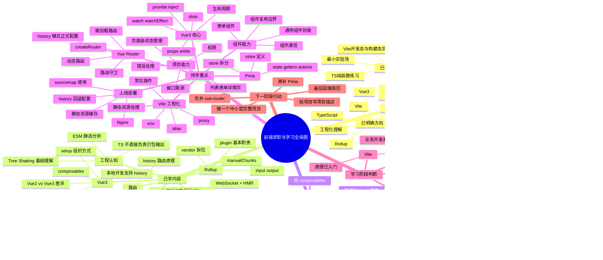

# 简历与学习全局思维导图

> 说明：这份图基于当前项目里的已知信息整理。  
> 其中“简历现状”部分只整理出目前能确认的技术方向与项目实践，等你后续补充真实简历内容后，我们可以再继续细化。

## 一句话看全局

你现在已经完成了：
- `Vue3 + Vite + TS` 的基础认知搭建
- 开发态、构建态、HMR、ESM 的底层理解
- Composition API 与 TS 纯函数练习

你现在还缺的是：
- 标准业务开发链路
- 官方路由与状态管理
- 能写进简历的完整项目描述

## 简历视角拆解

### 现在能写的

- 搭建并维护 `Vue3 + Vite + TypeScript` 实验项目
- 理解并实践 `Vite dev`、`vite build`、`Rollup` 分工
- 理解 `ESM`、`Tree Shaking`、`HMR` 的基本机制
- 使用 `Composition API` 与 `composables` 组织页面逻辑
- 使用 `TypeScript` 完成基础业务建模与类型守卫练习

### 现在还不建议写得太重的

- 大型后台管理系统经验
- 复杂状态管理经验
- 生产部署与上线优化经验
- 成熟组件库封装经验

## 推荐学习顺序

1. `vue-router`
2. `Pinia`
3. 做一个完整 CRUD 项目
4. 补 Vite 工程化配置
5. 补部署与构建优化
6. 回写简历项目描述

## 下一份可交付目标

下一阶段最值得做的，不是继续零散记概念，而是完成一个真正能写进简历的项目，至少包含：

- 登录或权限
- 路由
- Pinia
- 列表/表单/详情
- 接口请求
- 状态管理
- 构建与部署说明

