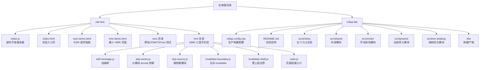
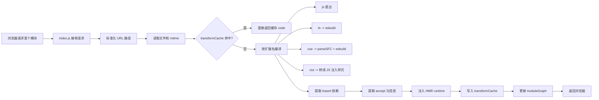
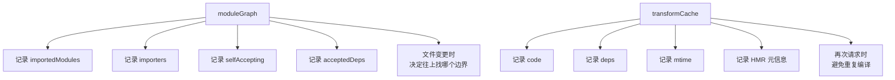
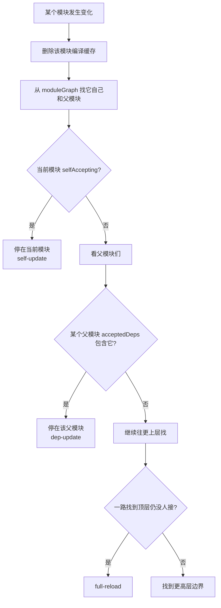
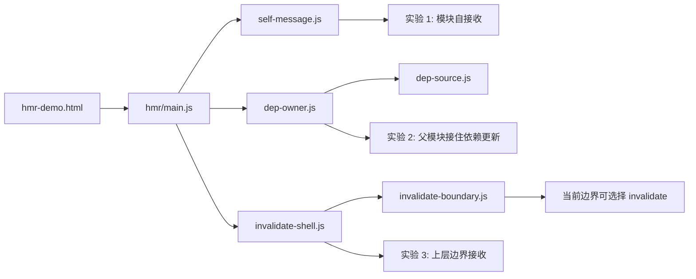
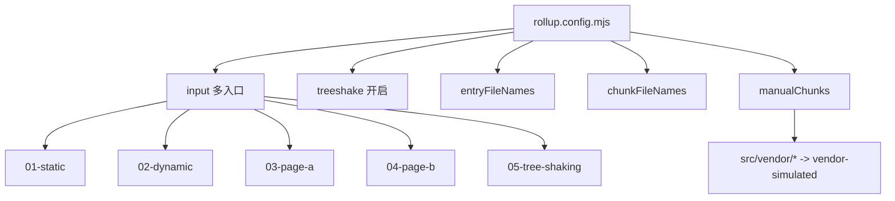
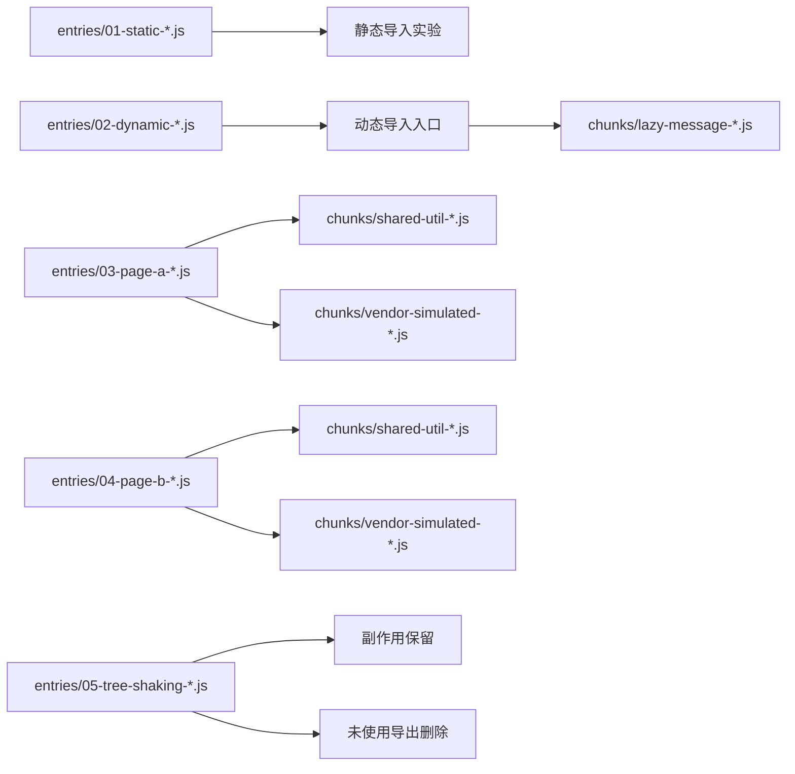

# 前端构建实验总览

这份文档的目标不是讲细节，而是先帮你建立一张“全局地图”。

你现在仓库里和本轮新增内容最相关的实验，主要分成两大块：

- `vite-test`
  重点理解开发态：按需请求、按需编译、模块图、HMR
- `rollup-lab`
  重点理解生产构建：chunk、动态导入、共享模块、手动拆包、tree-shaking、hash

如果你后面要把这份文档复制到别的绘图工具里，优先尝试：

- `Mermaid mindmap`
- `Mermaid flowchart`
- 普通 Markdown 大纲

---

## 一、全局思维导图

```mermaid
mindmap
  root((前端构建实验总览))
    vite-test 开发态原理
      开发服务器
        express 接收请求
        路径标准化
        读取源文件
        按扩展名编译
      按需编译
        js 直出
        ts -> esbuild
        vue -> compiler-sfc + esbuild
        css -> 注入 style 标签
      模块图 moduleGraph
        importedModules 我依赖谁
        importers 谁依赖我
        selfAccepting 是否自接收
        acceptedDeps 接收哪些依赖更新
      编译缓存 transformCache
        code
        deps
        mtime
        HMR 元信息
      HMR
        accept
        dispose
        data
        invalidate
        full reload
      页面实验
        首页 index.html
        ESM 请求链路 esm-demo.html
        最小 HMR 页面 hmr-demo.html
      HMR 子实验
        self-message.js
          自接收
          data 保留状态
        dep-owner.js + dep-source.js
          父模块接住依赖更新
        invalidate-boundary.js + invalidate-shell.js
          当前边界放弃处理
          继续向上冒泡
      调试入口
        __debug/module-graph
        __hmr
        __hmr_client__.js
    rollup-lab 生产构建原理
      rollup.config.mjs
        input 多入口
        treeshake
        entryFileNames
        chunkFileNames
        manualChunks
      五组实验
        01-static
          静态导入
          接近单入口产物
        02-dynamic
          import()
          产生懒加载 chunk
        03-page-a
          共享 shared-util
        04-page-b
          共享 shared-util
        05-tree-shaking
          未使用导出被删除
          顶层副作用保留
      公共模块
        shared-util.js
          自动共享 chunk
        fake-vendor.js
          manualChunks 手动 vendor chunk
        lazy-message.js
          动态加载 chunk
        library.js
          tree-shaking 主体
        side-effect.js
          顶层副作用
      构建结果 dist
        entries
        chunks
        hash 文件名
```

---

## 二、项目结构图



---

## 三、vite-test 总览图

### 1. 开发服务器总流程



### 2. 模块图和缓存的关系



### 3. HMR 传播图



### 4. HMR 三组实验对应关系



---

## 四、rollup-lab 总览图

### 1. 生产构建配置图



### 2. 五组构建实验图

```mermaid
flowchart TD
    A[01-static] --> A1[只有静态导入]
    A1 --> A2[观察入口 chunk 结构]

    B[02-dynamic] --> B1[使用 import()]
    B1 --> B2[观察 lazy chunk]

    C[03-page-a + 04-page-b] --> C1[共同依赖 shared-util.js]
    C1 --> C2[观察 shared chunk]

    D[src/vendor/fake-vendor.js] --> D1[被 manualChunks 指定]
    D1 --> D2[观察 vendor-simulated chunk]

    E[05-tree-shaking] --> E1[只使用 usedValue]
    E1 --> E2[unused 导出应消失]
    E1 --> E3[side-effect.js 顶层副作用应保留]
```

### 3. 构建结果产物关系图



---

## 五、按“学习难度最低”排序的学习路线

如果你不想一下看太多，建议按这个顺序学：

### 第 1 阶段：先理解开发态为什么快

1. `vite-test/esm-demo.html`
2. `vite-test/esm/1.js -> 2.js -> 3.js -> 4.ts -> 5.vue`
3. `vite-test/index.js` 里的 `transformRequest`

目标：

- 明白浏览器会逐个请求模块
- 明白服务端只编译当前请求到的模块

### 第 2 阶段：理解模块图和缓存

1. `vite-test/index.js` 的 `ensureModuleNode`
2. `vite-test/index.js` 的 `syncModuleGraph`
3. `vite-test/index.js` 的 `transformCache`
4. 打开 `http://localhost:3000/__debug/module-graph`

目标：

- 明白为什么开发态仍然需要模块图
- 明白缓存缓存的不是组件状态，而是编译结果

### 第 3 阶段：理解 HMR

1. `hmr/self-message.js`
2. `hmr/dep-owner.js + hmr/dep-source.js`
3. `hmr/invalidate-boundary.js + hmr/invalidate-shell.js`
4. 回头看 `collectHmrUpdates`

目标：

- 明白 `accept / dispose / data / invalidate`
- 明白 HMR boundary 是什么

### 第 4 阶段：理解生产构建

1. `rollup-lab/rollup.config.mjs`
2. `rollup-lab/src/entries/01-static.js`
3. `rollup-lab/src/entries/02-dynamic.js`
4. `rollup-lab/src/entries/03-page-a.js` 和 `04-page-b.js`
5. `rollup-lab/src/entries/05-tree-shaking.js`
6. `rollup-lab/dist`

目标：

- 明白 chunk 是怎么来的
- 明白动态导入、共享模块、手动拆包、tree-shaking、hash

---

## 六、最小术语表

### 1. 模块图

开发服务器维护的一张依赖关系图。

- `importedModules`：我依赖谁
- `importers`：谁依赖我

### 2. 编译缓存

缓存某个模块编译后的结果，避免重复转换。

### 3. HMR boundary

能把热更新“接住”的模块边界。

- 模块自己 `accept()`，自己就是边界
- 父模块 `accept('./child.js')`，父模块就是边界

### 4. chunk

最终构建产物中的一个 JS 文件，不等于“一个源文件一个 chunk”。

### 5. tree-shaking

把静态可分析、且确实没被用到的代码从最终产物中删掉。

### 6. hash

产物内容指纹，用来做缓存控制。内容一变，hash 往往也会变。

---

## 七、你现在可以把整个项目先记成一句话

```text
vite-test = 学开发态：浏览器按需请求 + 服务端按需编译 + 模块图 + HMR
rollup-lab = 学生产态：多入口构建 + chunk 拆分 + tree-shaking + hash
```

---

## 八、下一步建议

等你看完这张总览图，我们再按下面顺序一个一个深入：

1. 先只学 `vite-test` 的 ESM 请求链路
2. 再学 `moduleGraph + transformCache`
3. 再学 `HMR 三组实验`
4. 最后学 `rollup-lab`

如果你愿意，下一轮我可以直接按这份总览，从“`vite-test` 开发态总流程图”开始，一步一步带你把每个节点和真实代码对上。
