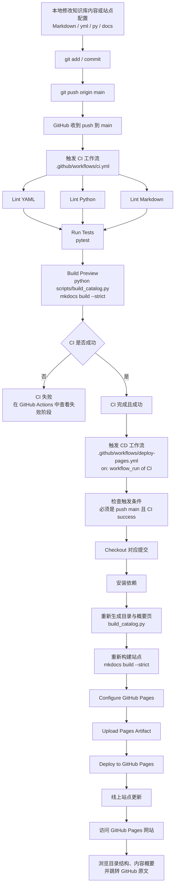

# CI/CD 流程记录

这份文档记录当前个人知识库仓库已经落地的 `CI + CD` 流程，以及实现过程中遇到的问题与处理方式。

## 当前完整流程



## 关键文件职责

- `.github/workflows/ci.yml`
  - 负责检查、测试和预构建。
  - 包含 `YAML / Python / Markdown` lint、`pytest`、`Build Preview`。
- `.github/workflows/deploy-pages.yml`
  - 负责正式部署。
  - 监听 `CI` 成功完成后的 `workflow_run`，并在 `push main` 场景下发布到 GitHub Pages。
- `scripts/build_catalog.py`
  - 负责扫描知识库 Markdown。
  - 自动生成目录页、文件概要页和 GitHub 跳转链接。
- `mkdocs.yml`
  - 负责站点配置、导航和校验规则。
- `docs/`
  - 存放站点静态页面。

## 当前触发规则

### `CI`

- `pull_request`
- `push` 到 `main`

### `CD`

- 监听 `CI` 工作流完成
- 且必须满足：
  - `CI` 结论是 `success`
  - 触发 `CI` 的事件是 `push`
  - 分支是 `main`

## 实施过程中的问题记录

### 1. YAML lint 失败

- 现象：`yamllint` 报多个 YAML 文件缺少文档起始符。
- 根因：`.yml` / `.yaml` 文件没有 `---`。
- 处理：为 workflow、`mkdocs.yml`、lint 配置文件补上 `---`。

### 2. GitHub Actions 运行时版本告警

- 现象：`setup-python`、`setup-node` 出现 Node 20 deprecation 提示。
- 根因：Actions 版本偏旧。
- 处理：升级到：
  - `actions/checkout@v6`
  - `actions/setup-python@v6`
  - `actions/setup-node@v6`

### 3. Python lint 失败

- 现象：`ruff` 报导入顺序、超长行等问题。
- 根因：脚本和测试文件未完全按 Ruff 规范书写。
- 处理：
  - 调整 `import` 顺序
  - 拆分超长字符串
  - 统一按当前 `pyproject.toml` 规则约束 Python 文件

### 4. Markdown lint 失败

- 现象：`markdownlint` 对现有文档报错较多。
- 根因：初始检查范围过宽，规则与当前文档现状不完全匹配。
- 处理：
  - 收敛 lint 范围到站点相关文档
  - 忽略 `docs/_generated` 与 `temp`
  - 关闭当前阶段不适合强制的部分规则

### 5. pytest 导入失败

- 现象：`ModuleNotFoundError: No module named 'scripts'`
- 根因：测试运行时没有稳定找到仓库根目录。
- 处理：新增 `tests/conftest.py`，把仓库根目录加入 `sys.path`。

### 6. Build Preview 在 `mkdocs build --strict` 失败

- 现象：
  - 自动生成页面未进入 `nav`
  - 生成页内包含原文相对链接，MkDocs 校验时报目标不存在
- 根因：
  - `_generated` 页面是构建时生成的，不适合手工逐个写入导航
  - 摘要/预览直接带出了原始 Markdown 链接
- 处理：
  - 在 `mkdocs.yml` 中设置 `validation.nav.omitted_files: ignore`
  - 在 `build_catalog.py` 中清洗摘要与预览里的 Markdown 链接
  - 新增对应回归测试

## 现在的日常使用方式

```powershell
git add .
git commit -m "更新知识库"
git push origin main
```

执行后会按以下顺序自动完成：

1. 触发 `CI`
2. 完成 lint、test、preview build
3. `CI` 成功后触发 `Deploy GitHub Pages`
4. 正式部署到 GitHub Pages
5. 线上站点更新

## 当前状态

- `CI + CD` 已经拆分完成
- `Build Preview` 已经打通
- 正式部署链路已接通 GitHub Pages
- 当前流程已接近常见团队项目中的“先校验、再发布”模式
